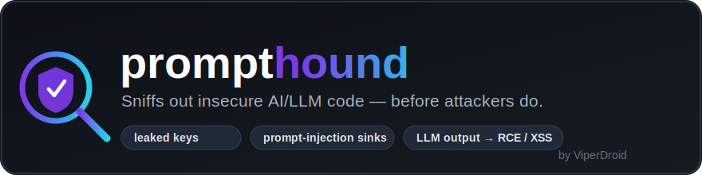
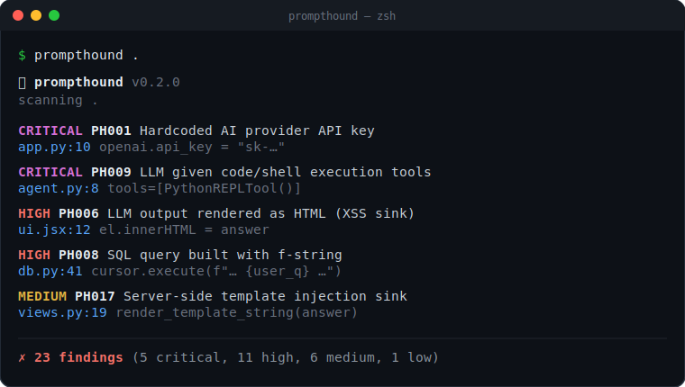
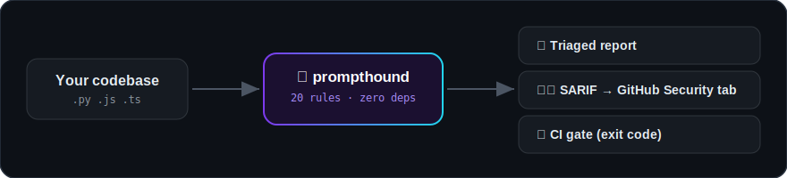

<p align="center">
  
</p>

<p align="center">
  
  
  
  
  
</p>

> **Sniffs out insecure AI/LLM code — before attackers do.** `prompthound` is a fast, **zero-dependency** static analyzer that scans your codebase for the security mistakes that show up when apps wire in LLMs: leaked keys, prompt-injection sinks, and model output flowing into **RCE / XSS / SQLi**.

Runtime scanners (garak, promptfoo, PyRIT) test your *running model*. **prompthound scans your *source code*** — the other half of the problem. Point it at a repo and get a triaged report in seconds. No API key, no network, no dependencies.

## 🎬 Demo

<p align="center">
  
</p>

```console
$ prompthound examples/

🐶 prompthound  v0.2.0
   scanning examples/

 CRITICAL  PH001  Hardcoded AI provider API key
   examples/vulnerable_app.py:10
     openai.api_key = "sk-abcdefghijklmnopqrstuvwxyz0123456789ABCD"
   why: An LLM/API key is hardcoded in source. Anyone with repo access can use it.
   fix: Load keys from environment variables or a secrets manager; rotate any exposed key.

 CRITICAL  PH002  eval()/exec() execution sink
   examples/vulnerable_app.py:23
     eval(answer)
   why: If any LLM output or user input can reach this call, it is remote code execution.
   fix: Avoid eval/exec on dynamic data. Use ast.literal_eval or json.loads and validate.

 HIGH  PH006  LLM output rendered as HTML (XSS sink)
   examples/vulnerable_app.js:12
     el.innerHTML = answer;
   why: If model output is rendered here without encoding, the model can emit active HTML/JS -> XSS.
   fix: Render model output as text, or sanitize with a vetted library (e.g. DOMPurify).

 ... 20 more ...

✗ 23 findings  (5 critical, 11 high, 6 medium, 1 low)
```

## ⚙️ How it works

<p align="center">
  
</p>

## 🔎 What it catches

| ID | Severity | What |
|----|----------|------|
| PH001 | 🟣 CRITICAL | Hardcoded AI provider API key (`sk-...`) |
| PH002 / PH004 | 🟣 CRITICAL | `eval` / `exec` / `new Function` execution sinks |
| PH009 | 🟣 CRITICAL | LLM given code/shell tools (LangChain `PythonREPLTool`, `ShellTool`, `allow_dangerous_*`) |
| PH003 / PH005 | 🔴 HIGH | Shell / child-process execution sinks |
| PH006 | 🔴 HIGH | LLM output → HTML (`innerHTML`, `dangerouslySetInnerHTML`, `v-html`) → XSS |
| PH008 | 🔴 HIGH | SQL built with f-strings → injection |
| PH012 | 🔴 HIGH | Insecure deserialization (`pickle.loads`) |
| PH010 / PH011 | 🔴 HIGH / 🟡 MED | TLS verification disabled |
| PH007 | 🟡 MEDIUM | Prompt/query built from raw web-request input |
| PH013 | 🟡 MEDIUM | Unsafe `yaml.load` |
| PH015 | 🟡 MEDIUM | Redirect/navigation sink (open redirect) |
| PH016 | 🟡 MEDIUM | Possible SSRF sink (dynamic request URL) |
| PH017 | 🔴 HIGH | Server-side template injection (`render_template_string`) |
| PH018 | 🟡 MEDIUM | Debug mode enabled (Flask/Werkzeug console → RCE) |
| PH019 | 🟣 CRITICAL | Hardcoded cloud credential (`AKIA…`) |
| PH020 | 🔴 HIGH | More LLM→HTML sinks (`insertAdjacentHTML`, `outerHTML`) |
| PH014 | 🔵 LOW | Prompts / secrets written to logs |

**20 rules** across **Python** and **JavaScript / TypeScript** — run `prompthound --list-rules` to see them all.

## 📦 Install

```bash
pipx install prompthound        # recommended (isolated)
# or
pip install prompthound
```

Or run straight from source (no install):

```bash
git clone https://github.com/ViperDroid/prompthound.git
cd prompthound
python -m prompthound examples/
```

## 🚀 Usage

```bash
prompthound                       # scan current directory
prompthound path/to/project       # scan a folder or file
prompthound . --min-severity HIGH # only HIGH and CRITICAL
prompthound . --json              # machine-readable output for tooling
prompthound . --sarif             # SARIF 2.1.0 for GitHub code scanning
prompthound --list-rules          # show every detection rule
```

Exit code is **1** when findings are reported (at or above `--min-severity`) and **0** when clean — so it drops straight into CI.

**Silence a false positive** with an inline marker:

```python
dangerous = eval(trusted_input)  # prompthound: ignore
```

## 🤖 Use in CI (GitHub Actions)

```yaml
- uses: actions/setup-python@v5
  with: { python-version: "3.x" }
- run: pip install prompthound
- run: prompthound . --min-severity HIGH   # fails the build on HIGH/CRITICAL
```

Or surface findings in the repo's **Security → Code scanning** tab via SARIF:

```yaml
- run: pip install prompthound
- run: prompthound . --sarif > prompthound.sarif || true
- uses: github/codeql-action/upload-sarif@v3
  with:
    sarif_file: prompthound.sarif
```

## 🧠 How it works (and its limits)

prompthound is a **heuristic, pattern-based** analyzer — fast and dependency-free by design. It flags *risky patterns and dangerous sinks* (the places LLM/untrusted output must never reach). It is a **triage tool, not a proof**: expect some false positives, and always confirm findings in context. Rules live in [`prompthound/rules.py`](prompthound/rules.py) and are intentionally readable so you can audit and extend them.

## 🧩 Add your own rule

A rule is just a dict with a regex:

```python
{
  "id": "PH016", "severity": "HIGH", "langs": {"py"}, "ignorecase": False,
  "title": "My custom sink",
  "pattern": r"my_dangerous_call\s*\(",
  "why": "Why it's risky.",
  "fix": "How to fix it.",
}
```

PRs adding rules or language support are welcome.

## 📜 License

[MIT](LICENSE) © **ViperDroid**

---

<p align="center"><sub>Built by <b>ViperDroid</b> · scan your AI code before someone else does 🐶</sub></p>
